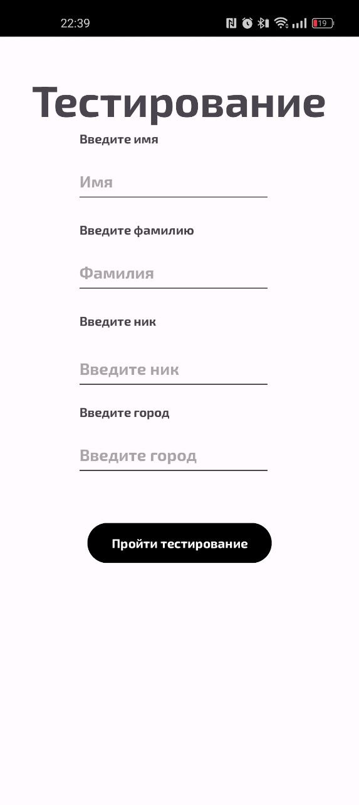

# AppForTesting 🧪

Мобильное приложение для тестирования, разработанное на Java. Приложение позволяет пользователям проходить тесты и проверять свои знания в различных областях.

---

## 📱 О проекте

**AppForTesting** — это простое и удобное мобильное приложение, созданное для проведения тестов. Оно подходит для образовательных целей, проведения опросов или проверки знаний.

### Основные функции:
- Прохождение тестов с выбором правильного ответа.
- Отображение результатов тестирования.
- Простой и интуитивно понятный интерфейс.

---

## 🛠️ Технологии

- **Язык программирования**: Java
- **Инструменты разработки**: Android Studio
- **Система управления версиями**: Git

---

## 🚀 Как запустить проект

### Требования:
- Android Studio (рекомендуется последняя версия).
- Устройство с Android или эмулятор.

### Шаги для запуска:
1. Склонируйте репозиторий:
   ```bash
   git clone https://github.com/MiWanya/AppForTesting.git
2. Откройте проект в Android Studio.
3. Подключите устройство или запустите эмулятор.
4. Нажмите Run в Android Studio, чтобы собрать и запустить приложение.

---

## 📂 Структура проекта
AppForTesting/
├── app/
│   ├── src/
│   │   ├── main/
│   │   │   ├── java/com/example/appfortesting/  # Основной код приложения
│   │   │   ├── res/                            # Ресурсы (layout, drawable, strings)
│   │   │   └── AndroidManifest.xml             # Манифест приложения
│   └── build.gradle                            # Конфигурация сборки
├── .gitignore                                  # Игнорируемые файлы
└── README.md                                   # Этот файл

---

## 📸 Скриншоты

<div align="center">   </div>

### 📫 Связь
Если у вас есть вопросы или предложения, свяжитесь со мной:

Telegram: @MiWanya24

Email: miwanyalv@vk.com

VK: [MiWanya](https://vk.com/miwanyalv)
